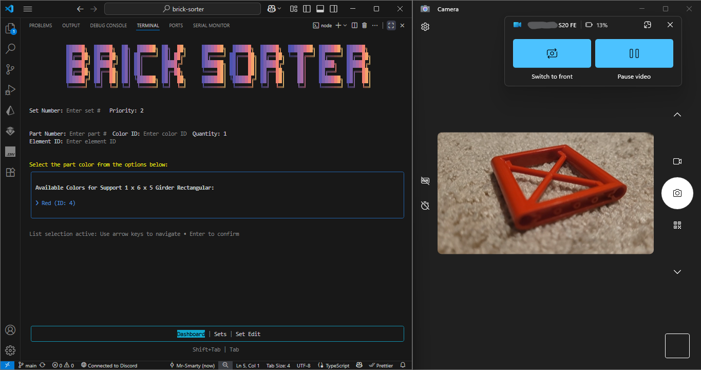
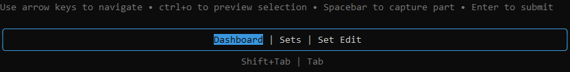
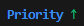
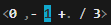
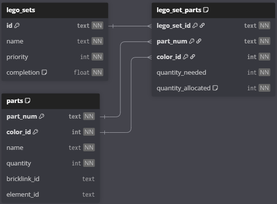

# brick-sorter-cli

This tool is made for you if you know which Lego sets you have, but their parts are all mixed. This tool allows you to add your sets, then sort your parts into their sets using a camera/webcam. It also functions as a part inventory.

## Table of Contents

-   [Install](#install)
    -   [Physical Webcam](#physical-webcam)
    -   [OpenCV](#opencv)
-   [Using the CLI](#using-the-cli)
    -   [Navigation and Controls](#navigation-and-controls)
        -   [Scrollboxes](#scrollboxes)
    -   [Tabs](#tabs)
        -   [Dashboard](#dashboard)
        -   [Sets](#sets)
        -   [Set Edit](#set-edit)
    -   [Adding Sets](#adding-sets)
    -   [Adding Parts](#adding-parts)
        -   [Use the dashboard](#use-the-dashboard)
        -   [Use Set Edit](#use-set-edit)
-   [Features](#features)
    -   [Priority](#priority)
    -   [Soft Completion](#soft-completion)
    -   [Tuneable Vision Recognition](#tuneable-vision-recognition)
    -   [Part Recognition Logic](#part-recognition-logic)
        -   [Decorated Parts](#decorated-parts)
    -   [SQLite Database](#sqlite-database)
        -   [Schema](#schema)

## Install

You will need Node JS installed. If you run into issues, note the project was built with `v22.16.0`. Make sure your computer has been restarted since installing Node JS.

### Physical Webcam

This applies if:

-   You have a physical webcam, USB camera, etc.
-   You can connect your phone or another device such that its detected as a physical camera by your computer

Follow the steps below to install the project.

1. install npm modules with this command:

    ```
    npm run install:physical
    ```

2. Configure CLI parameters:

    1. Make a copy of `example.env` in the same folder.
    2. Rename copy to `.env`.
    3. Fill fields. You will need to make an account with [Rebrickable](https://rebrickable.com/home/) to get an API key from the profile settings. Your `CAMERA_TYPE` is `physical`.

3. Build the project:

    ```
    npm run build
    ```

    You may need to go into `node_modules/@rebrickableapi/types/endpoints.ts` and remove `SearchEndpointUrl` and `SearchParameters` to compile because of issues with the typescript `skipLibCheck` option.

4. Install the CLI globally:

    ```
    npm install --global C:/path/to/brick-sorter
    ```

    - Test by running `brick-sorter-cli`. If it can't find the command, run the install command above again in a new terminal outside the repository. If it still doesn't work, ensure `npm config prefix` is set correctly:

        ```
        npm config set prefix C:\Users\{username}\AppData\Roaming\npm
        ```

        NOTE: this may differ depending on your installation situation (if using nvm for example).

#### Using your phone camera (Windows 11)

Through the Phone Link app, you can easily use your phone as a physical camera for your computer.

1. With the devices already linked, open `Manage Cameras` in system settings.
2. Select your phone.
3. Go to `Advanced camera options`.
4. Enable `Allow multiple apps to use camera at the same time`.
5. Open the Windows camera app and use the `Change camera` button to start the connection and see your phone camera.
6. Arrange the camera and CLI windows on screen (if you minimize the camera, it cuts the connection).
7. Use the CLI as normal, no camera delay configuration required.



### OpenCV

Follow these instructions to use OpenCV for your camera. This makes it possible to use DirectShow devices such as the OBS Virtual Camera.

These instructions will cover a manual installation on Windows, given the numerous issues that are possible trying to install automatically. If you can successfully install automatically, feel free. Some steps may have already been completed if you've previously used Node JS. Links are included for installation on other platforms.

1. Prepare to install `node-gyp`. More instruction and options [here](https://github.com/nodejs/node-gyp).

    1. Install Python from [website](https://www.python.org/downloads/), Microsoft Store, or package manager.
        - double check the installation by running `python --version` in a new terminal.
    2. Install Visual Studio from [here](https://visualstudio.microsoft.com/thank-you-downloading-visual-studio/?sku=Community). Select the `Desktop development with C++` workload when installing. When done, restart your computer.
        - You can remove components, but at minimum keep `MSVC v1** - VS 20** C++ x64/x86 build tools` and `Windows 11 SDK` selected.

2. Install OpenCV from [here](https://opencv.org/releases/). The extracted `opencv` folder can be placed anywhere

3. Create the following environment variables to point to your installation:

    ```
    OPENCV_BIN_DIR = C:\path\to\opencv\build\x64\vc**\bin
    OPENCV_INCLUDE_DIR = C:\path\to\opencv\build\include
    OPENCV_LIB_DIR = C:\path\to\opencv\build\x64\vc**\lib
    ```

    Add `%OPENCV_BIN_DIR%` to your `PATH` variable as well.

4. Create an environment variable to disable automatic OpenCV installation.

    ```
    OPENCV4NODEJS_DISABLE_AUTOBUILD = 1
    ```

    This variable can be deleted at the end.

5. Open the repository in VS Code or a terminal. Install npm modules with this command:

    ```
    npm run install:opencv
    ```

    _This will take awhile._

6. Configure CLI parameters:

    1. Make a copy of `example.env` in the same folder.
    2. Rename copy to `.env`.
    3. Fill fields. You will need to make an account with [Rebrickable](https://rebrickable.com/home/) to get an API key from the profile settings. Your `CAMERA_TYPE` is `opencv`.

7. Build the project:

    ```
    npm run build
    ```

    You may need to go into `node_modules/@rebrickableapi/types/endpoints.ts` and remove `SearchEndpointUrl` and `SearchParameters` to compile because of issues with the typescript `skipLibCheck` option.

8. Install the CLI globally:

    ```
    npm install --global C:/path/to/brick-sorter
    ```

    - Test by running `brick-sorter-cli`. If it can't find the command, run the install command above again in a new terminal outside the repository. If it still doesn't work, ensure `npm config prefix` is set correctly:
        ```
        npm config set prefix C:\Users\{username}\AppData\Roaming\npm
        ```
        NOTE: this may differ depending on your installation situation (if using nvm for example).

## Using the CLI

Start the CLI:

```
$ brick-sorter-cli
```

Options:

`--dbPath` Optional path to SQLite database file

This option is recommended to make sure the same database file is always used regardless of which directory the CLI is run from (See [SQLite Database](#sqlite-database) for more info).

Examples

```
$ brick-sorter-cli --dbPath="C:/Users/JohnDoe/documents/bricks.db"
```

### Navigation and Controls

As a CLI, it is controlled fully with keyboard. Throughout the interface, there are hints shown in gray text:



Focused values, inputs, or fields are denoted by a highlight, cursor, or blue text color.
**All changes made are applied immediately.**

`ctrl`+`o` can be used on most focused items to open a preview in your browser (to double check with a picture, ID, etc).

-   In the Sets list, this opens the set in Set Edit

#### Scrollboxes

Set and part lists are paginated with a default page size of 10 items. Use:

-   `↑` `↓` to scroll and focus on a part/set
-   `PgUp` `PgDn` to switch pages
-   `shift` + `PgUp` `PgDn` to change page size
-   `←` `→` to change list sort criterion
-   `enter` to change criterion order (indicated by green arrow)

    For example, sorting by increasing priority: 

    -   Additionally, the Set Edit parts list can be sorted by the allocated quantities by part count or the percentage allocated, increasing or decreasing.

-   `esc` resets the lists and sorting

### Tabs

The interface uses a tabbed system for different actions. Use `tab` and `shift`+`tab` to change tabs. (`shift`+`tab` may not work depending on your terminal).

#### Dashboard

-   Add new sets
-   Add parts by capture or manually entering info
-   View part allocation data

#### Sets

-   List all sets and their info
-   Sort by different fields

#### Set Edit

-   Edit set priority and soft-complete
-   Manually edit set part quantities
-   Sort and filter parts by different fields

### Adding Sets

Sets must be added before adding parts that belong to them. Add a set from the dashboard by entering the set number, changing the priority if desired, and pressing `enter`. You may be asked to confirm which set you intend.

### Adding Parts

#### Use the dashboard

-   Use `spacebar` to capture from camera and autofill part number and color after confirming.
-   Manually enter info. Either part number and color **OR** element ID is required.
-   Fill in the set number in addition to part info to add a part directly to a certain set. (Useful if you are trying to complete a specific set or have parts decorated with set specific stickers).

Use `ctrl`+`o` at any time to preview your part/color choice.

The allocation results will show on the right side. Multiple identical parts can be added at once by changing the quantity field. **Pay attention to the allocated quantities if adding multiple parts.**

#### Use Set Edit

-   Use `<` `,` `.` `>` to change the focused part's quantity in the parts list.

    

    -   `<` sets part's quantity to 0
    -   `,` decreases by 1
    -   `.` increases by 1
    -   `>` sets part's quantity to quantity needed (`3` in the example above)

The part list must be focused when changing part quantities. Changing the individual focused part can be done by scrolling with `↑` `↓`.

## Features

### Priority

Parts contained by multiple sets are allocated based on set priority. Set priority can be set when adding the set or changed in the Set Edit tab by using `shift`+`↑` to navigate to the priority field, changing the priority, and pressing `enter` to confirm.

### Soft Completion

Soft completion can be toggled in the Set Edit tab by using `shift`+`↑` to navigate to the completion percentage and pressing `enter`.

-   A `100%*` denotes "soft completion" which means the set doesn't have all parts, but the interface will treat it as complete.
-   This is useful if the set contains parts like sticker-sheets or brick separators that you don't care to include.
-   Parts can still be added from the Set Edit tab **but not from the dashboard**.

### Tuneable Vision Recognition

The application decides which part you are capturing using thresholds. The default behavior can be tuned by setting 2 variables in your `.env` file. Often times, a capture comes back with multiple matches of different confidence levels. Part recognition and confidence levels are provided by [brickognize](https://brickognize.com/).

-   `CERTAINTY_THRESHOLD` (default 0.85): controls at what confidence level the part match is considered certain, and will automatically select the part.
-   `SIMILARITY_THRESHOLD` (default 0.05): if multiple certain matches are found and within this threshold of eachother, you will be asked to double check the matches and select one.

    (For example match 1 (87%) and match 2 (91%) are within 5% (or 0.05) so another check will be made).

### Part Recognition Logic

The Lego part numbering scheme is very complex, and no single website/database does it the exact same. This application works for most parts, but there may be occasional edge cases. Parts are primarily added by part number and color, and with various other IDs as a backup. This means a newer part version may replace an older one if they are functionally identical and the same color. If a part is not being recognized, double check the IDs you are using exist in the Set Edit parts list, or looks for additional part information on [rebrickable](https://rebrickable.com/home/).

#### Decorated Parts

The app will attempt to correctly identify printed parts and parts with stickers, and add them directly to respective sets. For the best chance, make sure to capture a view of the part with the sticker/print clearly visible. Ensure the part is added to a specific set if it contains a set-specific sticker. If in doubt, use `ctrl`+`o` to preview the part to add and double check part/set info with rebrickable.

### SQLite Database

All data is persistent in a SQLite database. By default, it is created and stored in a `bricks.db` file in the directory the app is run from. Always run the app from the same directory, or use the optional `--dbPath` CLI argument to use the same database file path every time.

Editing the database is the only way to remove sets, and the best way to directly interact with the data.

#### Schema


